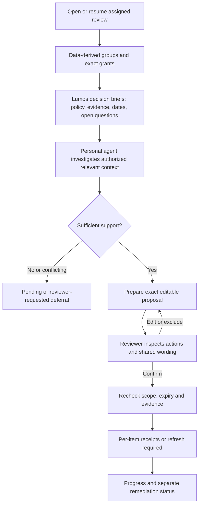

# Review flow

```mermaid
flowchart TD
  A[Open or resume assigned review] --> B[Data-derived groups and exact grants]
  B --> C[Lumos decision briefs: policy, evidence, dates, open questions]
  C --> D[Personal agent investigates authorized relevant context]
  D --> E{Sufficient support?}
  E -->|No or conflicting| F[Pending or reviewer-requested deferral]
  E -->|Yes| G[Prepare exact editable proposal]
  G --> H[Reviewer inspects actions and shared wording]
  H -->|Edit or exclude| G
  H -->|Confirm| I[Recheck scope, expiry and evidence]
  I --> J[Per-item receipts or refresh required]
  J --> K[Progress and separate remediation status]
```

Private sources remain with the personal agent. Only authorized minimal summaries enter Lumos. The same flow powers every fixture and host profile.
